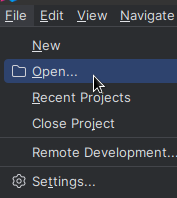
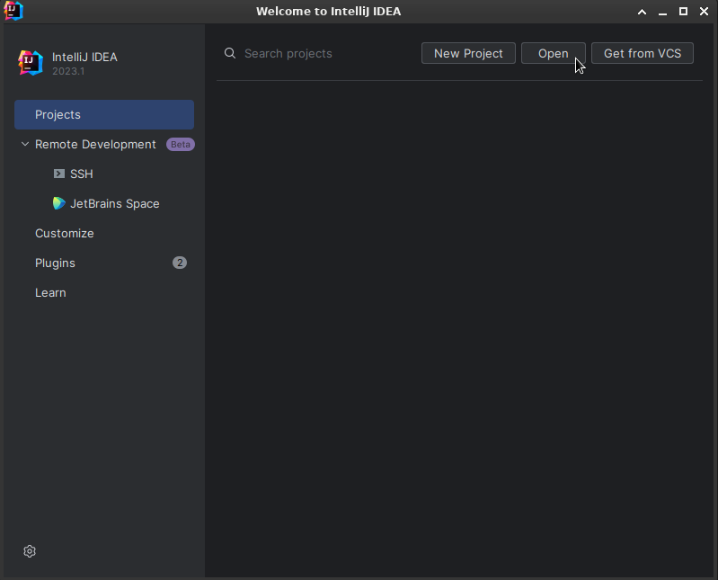
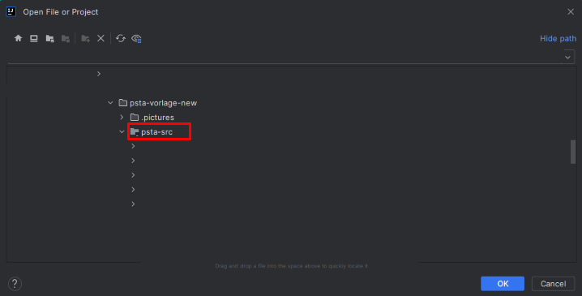
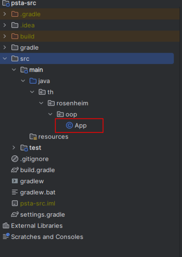

# OOP PStA Template Project

## How to get the project

### Download as ZIP
- To get the template project for your PStA, click on "Code-Download source code - zip"
- After downloading the source code, unzip the content. 
- In GitLab, switch to your repository. Clone your repository with `git clone [yourProjectURL]`.
- On your computer, replace the content of the cloned folder with the content of the ZIP file.
- Afterwards, add the new content with `git add .` to your local repository. Perform a commit with `git commit -m "Initial setup"` and push it with `git push -u origin main` into your GitLab repository.

## Open your project in IntelliJ

To open the project from IntelliJ move to File>Open... 

To open the project from the Welcome Screen click open

Then navigate to your project folder and open the psta-src folder in IntelliJ

After that the setup should be done automatically.

The main class is: `src/main/java/th/rosenheim/oop/App.java`
